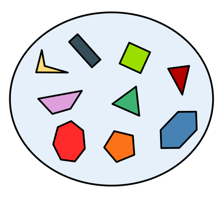
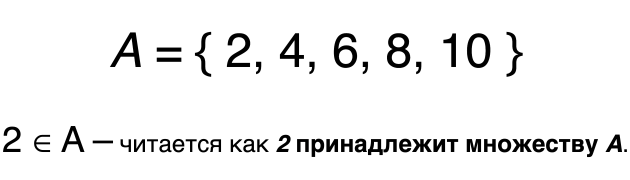
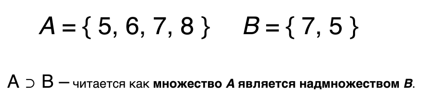
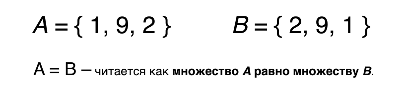
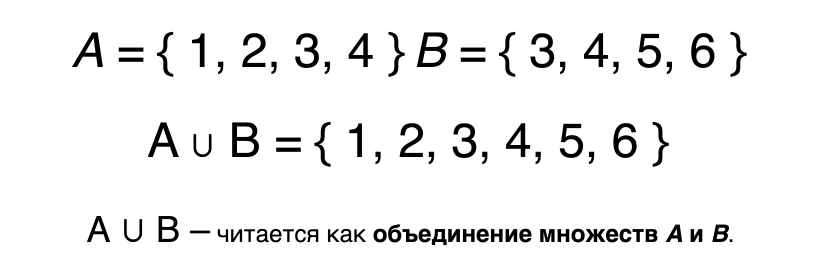
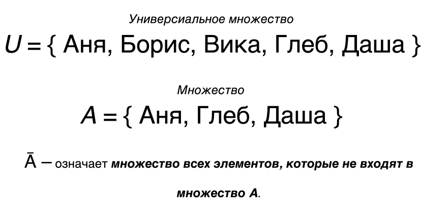

# 12. Работа с множествами


---

## Вступление

Добро пожаловать в тему множества!

В этой теме мы не просто изучим, как использовать множества в программировании, но и углубимся в математику,
а именно в раздел **"Теория множеств"**. Разберёмся, что такое множество, какие операции с ними бывают, и как
они помогают нам при решении задач. Помимо базовых операций и методов, мы также познакомимся с неизменяемыми 
множествами `frozenset()`.

---

## Содержание

- [Теория множеств](#теория-множеств)
- [Особенности множеств](#особенности-множеств)
- [Операции над множествами](#операции-над-множествами)
- [Методы множеств](#методы-множеств)
- [Неизменяемое множество frozenset()](#неизменяемое-множество-frozenset)
- [Аннотации типов](#аннотации-типов)
- [Задания](#задания)

---

## Теория множеств

Теория множеств - это фундаментальный раздел математики, лежащий в основе практически всех математических дисциплин.
Она формализует понятия *множества* и *элемента*, а также операции и отношения между множествами.

### Основные понятия

1. **Множество**

Множество - это совокупность объектов, объединённых по какому-либо признаку. Например, множество чётных чисел,
множество букв алфавита, множество студентов группы или множество геометрических фигур.



2. **Элемент множества**

Объект, входящий в состав множества, называется **элементом**. Например, число `2` является элементом множества
чётных чисел.



3. **Подмножество**

Если все элементы множества `B` входят в множество `A`, то `B` называется подмножеством `A`.


4. **Надмножество**

Надмножество - это множество `A`, которое содержит все элементы другого множества `B`.
Фактически, это просто обратная сторона понятия _подмножества_.



5. **Пустое множество**

Множество, не содержащее ни одного элемента называется _пустым множеством_ и обозначается символом `∅`.


6. **Равенство множеств**

Два множества равны, если содержат одни и те же элементы.



> Важно: Множество неупорядоченное хранилище и хранит только уникальные элементы, значит проверяется не
> порядок элементов, а их существование.

---

### Операции над множествами

1. **Объединение**

Множество, содержащее все элементы из двух (или более) исходных множеств.



2. **Пересечение**

Множество, включающее только те элементы, которые есть и в `A`, и в `B`.


3. **Разность множеств**

Множество, включающее элементы только из `A`, которых нет в `B`.


4. **Дополнение**

Дополнение множества `A` - это все элементы универсального множества `U`, которых нет в `A`.

Пример:

- Пусть `U` - это множество всех людей на планете: `{Аня, Борис, Вика, Глеб, Даша, и т.д.}`
- А `A` - это множество студентов: `{Аня, Глеб, Даша}`

Тогда `A̅` - это множество всех людей, **которые не являются студентами**, то есть `{Борис, Вика, и т.д.}`



Эти основные операции составляют основу работы с множествами.
Возникает логичный вопрос: **где на практике применяется теория множеств?**

- В базах данных при выполнении операций `JOIN`, `UNION`, `INTERSECT`
- В логике и математике при построении формальных моделей и структур
- В программировании (рассмотрим примеры ниже)

---

## Особенности множеств

Множества в Python - это структура данных, предназначенная для хранения **уникальных** и **неупорядоченных**
элементов. Они во многом похожи на математические множества, о которых мы говорили выше, но с рядом особенностей,
которые стоит знать.

**Уникальность элементов**

Множество не может содержать одинаковых значений. Если вы попытаетесь добавить повторяющееся значение - оно просто не
сохранится. В результате в множестве остаётся только один экземпляр каждого элемента.

```python
kids: set[str] = {"Маша", "Даша", "Аня", "Толя", "Аня", "Петя", "Маша", "Аня"}
print(kids)  # {'Аня', 'Толя', 'Даша', 'Маша', 'Петя'}
```

**Неупорядоченность**

Множество не сохраняет порядок элементов, то есть при выводе порядок может быть произвольным и каждый раз отличаться.

```python
colours: set[str] = {
    "черный", "белый", "жёлтый", "красный", "синий", "зелёный"
}

print(colours)  # {'черный', 'зелёный', 'жёлтый', 'красный', 'белый', 'синий'}
print(colours)  # {'красный', 'зелёный', 'белый', 'синий', 'черный', 'жёлтый'}
```

**Нельзя изменять элементы**

Множество не поддерживает доступ по индексу или замену элементов напрямую. Это связано с тем, что структура множества
не хранит позиции элементов, в отличие, например, от списков.

```python
colours: set[str] = {
    "черный", "белый", "жёлтый", "красный", "синий", "зелёный"
}

colours[2] = "оранжевый"  # TypeError: 'set' object does not support item assignment
```

**Только хэшируемые (неизменяемые) элементы**

Множества могут хранить только неизменяемые (хэшируемые) типы: числа, строки, кортежи, **но не списки** и др. изменяемые
типы. Попытка добавить изменяемый тип в множество приведёт к ошибке `TypeError: unhashable type`.

```python
digits_ru: set[tuple[int, str]] = {
    (1, "один"),
    (2, "два"),
    (3, "три"),
}  # это допустимо

digits_en: set[list[int | str]] = {
    [4, "four"],
    [5, "five"],
    [6, "six"],
}  # здесь будет ошибка: TypeError: unhashable type: 'list'
```

**Создание пустого множества**

Если для создания пустых списков и кортежей можно использовать как скобки `[]`, `()`, так и функции `list()`, `tuple()`,
то с множествами всё чуть иначе. Создать пустое множество можно только с помощью функции `set()`.

> Важно: Запись через `{}` создаёт не множество, а пустой словарь (изучим в следующей теме).

```python
seen: set[int] = set()
print(seen, type(seen))  # set() <class 'set'>

data = {}
print(data, type(data))  # {} <class 'dict'>
```

Множества в Python работают быстро и эффективно. Это отличный инструмент, когда нужно исключить дубликаты или выполнить
логические операции вроде объединения, пересечения или разности.

---

## Методы множеств

У множества также есть собственные методы, которые позволяют выполнять типовые действия: добавление, удаление,
обновление и др. операции. Ниже рассмотрим каждый из методов более подробно.

---

`set.add()` - добавляет один элемент в множество.

Метод `add()` принимает один аргумент и добавляет его в множество. Если элемент уже существует, он просто игнорируется.

```python
names: set[str] = {"Аня", "Глеб"}
names.add("Миша")
print(names)  # {'Аня', 'Миша', 'Глеб'}

names.add("Глеб")
print(names)  # {'Миша', 'Глеб', 'Аня'}
```

---

`set.update()` - добавляет сразу несколько элементов из итерируемого объекта.

Работает как `add()`, но добавляет **все элементы** из переданной последовательности (списка, кортежа, строки и т.д.).

```python
new_data: list[str] = ["банан", "груша"]
tropical: tuple[str, ...] = ("киви", "грейпфрут", "ананас")

fruits: set[str] = {"яблоко", "айва", "ананас"}
fruits.update(new_data)
print(fruits)  # {'банан', 'груша', 'ананас', 'яблоко', 'айва'}

fruits.update(tropical)
print(fruits)  # {'киви', 'грейпфрут', 'ананас', 'груша', 'яблоко', 'айва', 'банан'}

fruits.update("лимон")
print(fruits)  # {'груша', 'л', 'о', 'киви', 'м', 'айва', 'яблоко', 'ананас', 'и', 'банан', 'н', 'грейпфрут'}
```

---

`set.remove()` - удаляет указанный элемент.

Если элемента в множестве нет, то возникнет ошибка `KeyError`.

```python
animals: set[str] = {"тигр", "лев", "волк", "лиса", "медведь"}

animals.remove("лиса")
print(animals)  # {'лев', 'медведь', 'тигр', 'волк'}

animals.remove("кот")  # KeyError: 'кот'
```

---

`set.discard()` - безопасно удаляет указанный элемент.

Если элемент существует, то он удаляется, в противном случае ничего не происходит и ошибок не будет.

```python
animals: set[str] = {"тигр", "лев", "волк", "лиса", "медведь"}

animals.discard("лиса")
print(animals)  # {'медведь', 'лев', 'тигр', 'волк'}

animals.discard("кот")
print(animals)  # {'медведь', 'лев', 'тигр', 'волк'}
```

---

`set.pop()` - удаляет произвольный элемент.

Вы уже сталкивались с методом `list.pop()` у списков, метод удалял последний элемент и возвращал его. Так как
множества неупорядоченные, нельзя заранее знать какой элемент будет удалён. Если множество пустое возникнет `KeyError`.

```python
emoji: set[str] = {"🎲", "🎯", "🧩", "🎳"}

first: str = emoji.pop()
print(first)  # 🧩
print(emoji)  # {'🎳', '🎲', '🎯'}

second: str = emoji.pop()
third: str = emoji.pop()
fourth: str = emoji.pop()
print(emoji)  # set()

fifth: str = emoji.pop()  # KeyError: 'pop from an empty set'
```

---

`set.clear()` - полностью очищает множество.

Работает как у списков, после вызова метода множество становится пустым.

```python
emoji: set[str] = {"🎲", "🎯", "🧩", "🎳"}

emoji.clear()
print(emoji)  # set()
```

---

`set.copy()` - создаёт поверхностную копию множества.

Также работает как у списков, позволяет работать с копией объекта, не изменяя оригинал.

```python
transports: set[str] = {"автобус", "автомобиль", "электромобиль"}

temp_transports: set[str] = transports.copy()
temp_transports.add("трактор")

print(transports)  # {'электромобиль', 'автобус', 'автомобиль'}
print(temp_transports)  # {'автомобиль', 'автобус', 'трактор', 'электромобиль'}
```

---

Далее рассмотрим методы, основанные на классических операциях из теории множеств.

`set_a.union(set_b)` - объединяет множества.

Возвращает новое множество, содержащее все элементы из обоих множеств. Вместо метода можно использовать оператор `|`,
результат будет идентичным. Однако предпочтительнее использовать методы, они явно отражают смысл выполняемой операции
и повышают читаемость кода.

```python
a: set[int] = {1, 2, 3, 4}
b: set[int] = {3, 4, 5, 6}

res_1: set[int] = a.union(b)
res_2: set[int] = a | b

print(res_1)  # {1, 2, 3, 4, 5, 6}
print(res_2)  # {1, 2, 3, 4, 5, 6}
```

---

`set_a.intersection(set_b)` - возвращает пересечение множеств.

Возвращает новое множество, содержащее только общие элементы. Альтернативно можно использовать оператор `&`
вместо метода.

```python
a: set[int] = {1, 2, 3, 4}
b: set[int] = {3, 4, 5, 6}

res_1: set[int] = a.intersection(b)
res_2: set[int] = a & b

print(res_1)  # {3, 4}
print(res_2)  # {3, 4}
```

---

`set_a.difference(set_b)` - возвращает разность множеств.

Возвращает новое множество из элементов, присутствующих в `set_a`, но отсутствующих в `set_b`.
Аналогичная операция возможна с помощью оператора `-`.

```python
a: set[int] = {1, 2, 3, 4}
b: set[int] = {3, 4, 5, 6}

res_1: set[int] = a.difference(b)
res_2: set[int] = a - b

print(res_1)  # {1, 2}
print(res_2)  # {1, 2}
```

---

`set_a.symmetric_difference(set_b)` - симметрическая разность множеств.

Возвращает элементы, которые входят только в одно из двух множеств, исключая общие. То же самое можно сделать с
помощью оператора `^`.

```python
a: set[int] = {1, 2, 3, 4}
b: set[int] = {3, 4, 5, 6}

res_1: set[int] = a.symmetric_difference(b)
res_2: set[int] = a ^ b

print(res_1)  # {1, 2, 5, 6}
print(res_2)  # {1, 2, 5, 6}
```

---

Следующие методы возвращают логическое значение `True` или `False`, отвечая на конкретные вопросы о взаимосвязи
множеств.

`set_b.issubset(set_a)` - проверяет, является ли подмножеством.

Возвращает `True`, если все элементы `set_b` содержатся в `set_a`, в противном случае `False`.

```python
a: set[int] = {1, 5, 7, 9, 2}
b: set[int] = {1, 9}

print(b.issubset(a))  # True
print(a.issubset(b))  # False
```

---

`set_a.issuperset(set_b)` - проверяет, является ли надмножеством.

Возвращает `True`, если множество `set_a` содержит все элементы `set_b`, в противном случае `False`.

```python
a: set[int] = {1, 5, 7, 9, 2}
b: set[int] = {1, 9}

print(a.issuperset(b))  # True
print(b.issuperset(a))  # False
```

---

`set_a.isdisjoint(set_b)` - проверяет, есть ли общие элементы у множеств.

Если нет ни одного общего элемента возвращает `True`, в противном случае `False`. Удобно использовать при проверке
пересекаются ли множества.

```python
a: set[int] = {1, 2, 3, 4}
b: set[int] = {3, 4, 5, 6}
c: set[int] = {7, 8, 9}

print(a.isdisjoint(b))  # False
print(a.isdisjoint(c))  # True
print(b.isdisjoint(c))  # True
```

Как видно, некоторые методы множеств работают похоже на методы списков. Тем не менее, у них есть и своя специфика,
привыкание к ним и уверенное использование приходит с практикой. Далее рассмотрим неизменяемый тип
множества `frozenset()`.

---

## Неизменяемое множество `frozenset()`

Помимо изменяемого типа множества `set()`, в Python есть его неизменяемый аналог `frozenset()`. Его можно сравнить
с отношением `tuple()` к `list()` так же, как кортеж нельзя изменить после создания, множество `frozenset()` остаётся
неизменным после инициализации.

**Создание `frozenset()`**

Создать `frozenset` можно исключительно с помощью функции `frozenset()` и после создания множество становится
полностью неизменяемым.

```python
data: list[int] = [10, 20, 30, 40]
numbers: frozenset[int] = frozenset(data)
print(numbers)  # frozenset({40, 10, 20, 30})

usernames: tuple[str, ...] = ("admin", "moder", "root", "systemBoss")
safe_data: frozenset[str] = frozenset(usernames)
print(safe_data)  # frozenset({'moder', 'systemBoss', 'admin', 'root'})
```

> - Пустое множество `frozenset()` создать можно, но на практике это редко имеет смысл, так как основная ценность
    `frozenset` это хранение безопасных и неизменяемых данных, и пустое множество в этом контексте обычно
    не используется.
> - `frozenset()` можно использовать как ключ в словаре или элемент другого множества, поскольку он хешируемый и
    неизменяемый тип.

---

### Методы `frozenset()`

`frozenset()` поддерживает некоторые операции и методы, которые есть у `set()`, за исключением методов изменяющих
множество.

`frozenset_a.union(frozenset_b)` - объединяет множества.

Возвращает новое `frozenset`, которое содержит все элементы из `frozenset_a` и `frozenset_b`множества (удаляя
дубликаты). Аналогично можно использовать оператор `|`.

```python
a: frozenset[int] = frozenset({10, 20, 30})
b: frozenset[int] = frozenset({30, 40, 50})

res_1: frozenset[int] = a.union(b)
res_2: frozenset[int] = a | b

print(res_1)  # frozenset({50, 20, 40, 10, 30})
print(res_2)  # frozenset({50, 20, 40, 10, 30})
```

---

`frozenset_a.intersection(frozenset_b)` - возвращает пересечение множеств.

Возвращает новое `frozenset`, содержащее только общие элементы из двух множеств. Также можно использовать оператор `&`.

```python
a: frozenset[int] = frozenset({10, 20, 30, 40})
b: frozenset[int] = frozenset({30, 40, 50})

res_1: frozenset[int] = a.intersection(b)
res_2: frozenset[int] = a & b

print(res_1)  # frozenset({40, 30})
print(res_2)  # frozenset({40, 30})
```

---

`frozenset_a.difference(frozenset_b)` - возвращает разность множеств.

Возвращает новое `frozenset` из элементов множества `frozenset_a`, отсутствующих в `frozenset_b`. Можно также
использовать оператор `-`.

```python
a: frozenset[int] = frozenset({10, 20, 30, 40})
b: frozenset[int] = frozenset({30, 40, 50})

res_1: frozenset[int] = a.difference(b)
res_2: frozenset[int] = a - b

print(res_1)  # frozenset({10, 20})
print(res_2)  # frozenset({10, 20})
```

`frozenset_a.symmetric_difference(frozenset_b)` - симметрическая разность множеств.

Возвращает новое `frozenset`, состоящее из элементов, которые есть только в одном из двух множеств, исключая общие.
Аналогично можно использовать оператор `^`.

---

Кроме того, у `frozenset` есть следующие методы, которые работают так же, как у `set()`:

- `frozenset_b.issubset(frozenset_a)` - проверяет, является ли `frozenset_b` подмножеством `frozenset_a`.
  Возвращает `True`, если все элементы `frozenset_b` содержатся в `frozenset_a`, иначе `False`.
- `frozenset_a.issuperset(frozenset_b)` - проверяет, является ли `frozenset_a` надмножеством `frozenset_b`.
  Возвращает `True`, если `frozenset_a` содержит все элементы `frozenset_b`, иначе `False`.
- `frozenset_a.isdisjoint(frozenset_b)` - проверяет, пересекаются ли множества `frozenset_a` и `frozenset_b`.
  Возвращает `True`, если множества не имеют общих элементов, иначе `False`.

> Важно: у `frozenset` отсутствуют методы изменения множества: `add()`, `remove()`, `pop()`, `clear()` и `update()`,
> поскольку множество неизменяемое.

---

**Где используется `frozenset()`?**

`frozenset` полезен, когда необходимо хранить множество данных в неизменяемом виде, например:

- Когда важно гарантировать, что множество не будет случайно изменено в процессе работы программы.
- Для повышения безопасности и стабильности данных в сложных структурах.
- В качестве ключей словарей или элементов других множеств, так как `set` является изменяемым и не может использоваться
  для этих целей.

### Таблица 12.1: Сравнение `set()` и `frozenset()`

| Особенность                                      | `set()`           | `frozenset()`           |
|--------------------------------------------------|-------------------|-------------------------|
| Изменяемость                                     | Да                | Нет                     |
| Хешируемость                                     | Нет               | Да                      |
| Можно использовать как ключ словаря              | Нет               | Да                      |
| Можно использовать как элемент другого множества | Нет               | Да                      |
| Создание                                         | `set([iterable])` | `frozenset([iterable])` |

`frozenset()` дополняет стандартный `set()` и расширяет возможности по работе с коллекциями и безопасностью данных. В
повседневном программировании `frozenset()` встречается реже, чем `set()`, но в определённых случаях он незаменим.

---

## Аннотации типов

Как уже обсуждали в предыдущих темах аннотация типов это хорошая практика, повышает читаемость и надёжность кода.
Как помните в старых версиях Python (до версии 3.9) для аннотирования сложных типов необходимо было импортировать
типы из модуля `typing`. А начиная с версии 3.9 можно использовать встроенный синтаксис Python без
дополнительных импортов.

- **Подход до версии 3.9**:

Для `set`:

```python
from typing import Set

usernames: Set[str] = {"admin", "moder", "root", "systemBoss"}
points: Set[float] = {3.14, 6.28, 2.78, .546}
digits: Set[int] = {0, 1, 2, 3, 4, 5, 6, 7, 8, 9}
states: Set[bool] = {True, False}

print(usernames)  # {'root', 'moder', 'systemBoss', 'admin'}
print(points)  # {3.14, 0.546, 2.78, 6.28}
print(digits)  # {0, 1, 2, 3, 4, 5, 6, 7, 8, 9}
print(states)  # {False, True}
```

- Для `frozenset`:

```python
from typing import FrozenSet

usernames: FrozenSet[str] = frozenset({"admin", "moder", "root", "systemBoss"})
points: FrozenSet[float] = frozenset({3.14, 6.28, 2.78, .546})
digits: FrozenSet[int] = frozenset([0, 1, 2, 3, 4, 5, 6, 7, 8, 9])
states: FrozenSet[bool] = frozenset((True, False))

print(usernames)  # frozenset({'systemBoss', 'root', 'admin', 'moder'})
print(points)  # frozenset({0.546, 2.78, 3.14, 6.28})
print(digits)  # frozenset({0, 1, 2, 3, 4, 5, 6, 7, 8, 9})
print(states)  # frozenset({False, True})
```

- **Подход начиная с версии 3.9**:

Для `set`:

```python
usernames: set[str] = {"admin", "moder", "root", "systemBoss"}
points: set[float] = {3.14, 6.28, 2.78, .546}
digits: set[int] = {0, 1, 2, 3, 4, 5, 6, 7, 8, 9}
states: set[bool] = {True, False}

print(usernames)  # {'moder', 'systemBoss', 'admin', 'root'}
print(points)  # {2.78, 0.546, 3.14, 6.28}
print(digits)  # {0, 1, 2, 3, 4, 5, 6, 7, 8, 9}
print(states)  # {False, True}
```

- Для `frozenset`:

```python
usernames: frozenset[str] = frozenset({"admin", "moder", "root", "systemBoss"})
points: frozenset[float] = frozenset({3.14, 6.28, 2.78, .546})
digits: frozenset[int] = frozenset([0, 1, 2, 3, 4, 5, 6, 7, 8, 9])
states: frozenset[bool] = frozenset((True, False))

print(usernames)  # frozenset({'root', 'systemBoss', 'admin', 'moder'})
print(points)  # frozenset({0.546, 2.78, 3.14, 6.28})
print(digits)  # frozenset({0, 1, 2, 3, 4, 5, 6, 7, 8, 9})
print(states)  # frozenset({False, True})
```

Если в множествах хранятся сложные типы, например кортежи координат, типы можно указывать так:

```python
from typing import Tuple, Set, FrozenSet

# До 3.9
coordinates: Set[Tuple[int, int]] = {(0, 0), (1, 2), (3, 4)}
coordinates_2: FrozenSet[Tuple[int, int]] = frozenset({(0, 0), (1, 2), (3, 4)})

# С 3.9
coordinates: set[tuple[int, int]] = {(0, 0), (1, 2), (3, 4)}
coordinates_2: frozenset[tuple[int, int]] = frozenset({(0, 0), (1, 2), (3, 4)})
```

Используйте аннотации типов, точно не пожалеете. Они помогают быстрее разобраться в коде и вам, и тем,
кто будет читать ваш код.

---

## Заключение

Мы с вами изучили ещё один встроенный тип данных Python, и как видите, множества тесно связаны с математической теорией
множеств. Чтобы лучше понять тему, стоит немного освежить знания по теории множеств. Ниже в полезных ссылках будет
методичка из первой лекции университета, в которой собраны основные понятия и термины с простыми примерами.

Как только вы хорошо разберётесь в теории, смело переходите к практике, ведь работа с множествами требует прочного
понимания их сути. В следующей теме мы обсудим крайний встроенный тип данных **словари**.

---

## [Задания](./tasks/TASKS.md)

Практические задания для самостоятельной работы.

- Постарайтесь использовать только те знания, которые были изучены в пройденных темах.
  Не стоит использовать конструкции, которые мы ещё не разбирали.
- Убедитесь, что удалили все лишние комментарии из вашего кода.
- Постарайтесь указывать аннотации типов для переменных.
- Рекомендуем решить все задания самостоятельно.

Если возникнут трудности, не стесняйтесь обратиться за помощью в наш [Телеграм-чат](https://t.me/shox_py_discuss).
Чтобы перейти к заданиям, кликните на заголовок **Задания** или нажмите [сюда](./tasks/TASKS.md).

---

## Полезные ссылки

- [Telegram: Лекция №1. Основные понятия теории множеств](https://t.me/shox_py_discuss/36/94)

---
